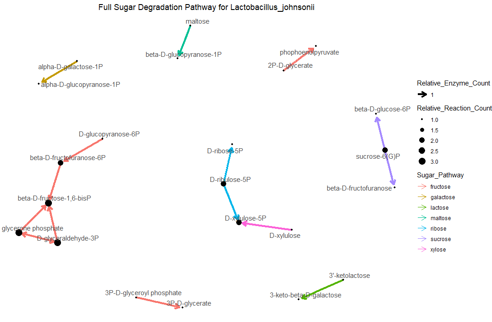
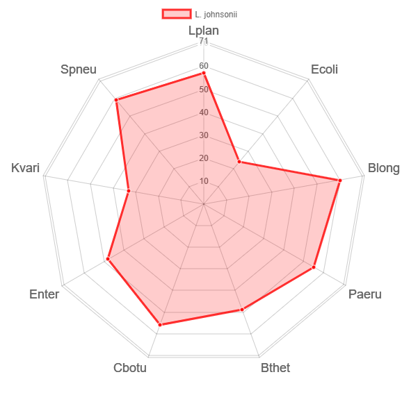
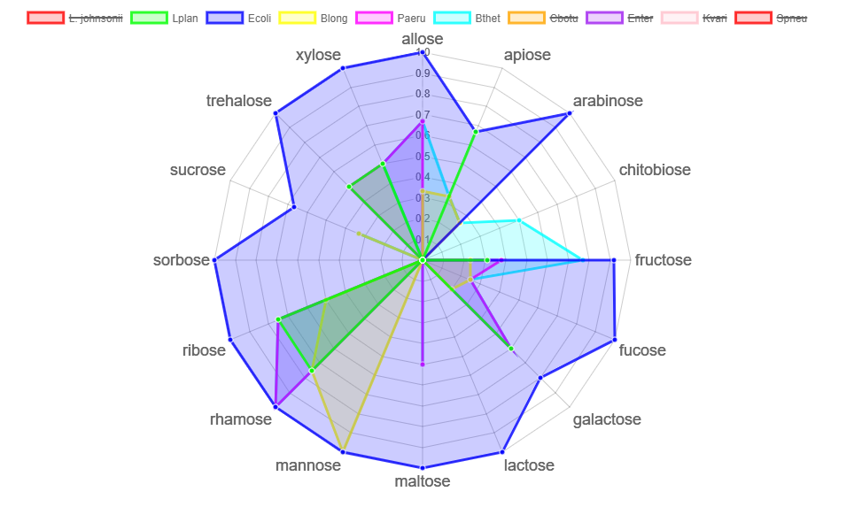
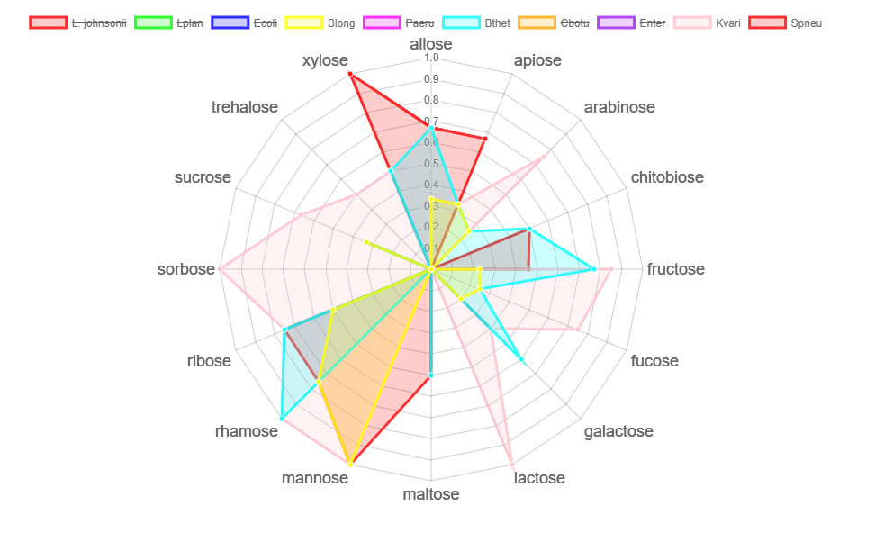

<!-- README.md is generated from README.Rmd. Please edit that file -->

```{r, include = FALSE}
knitr::opts_chunk$set(
  collapse = TRUE,
  comment = "#>",
  fig.path = "man/figures/README-",
  out.width = "100%"
)
```

# microCompet

<!-- badges: start -->
<!-- badges: end -->


## Description
R package _microCompet_ is for visualizing potential microbial competitions for nutrition, mainly simple sugars such as pentoses an pyranoses. This package offers functions to:
1. visualize all sugar degradation activities one microbe can carry out (See function constructFullNetwork)
2. Compare a microbe's overall sugar degradation pathway similarity to other microbes (See functions overallSimilarity and competeMicrobiota)


## Installation

```{r, eval = FALSE}
require("devtools")
devtools::install_github("MolyWang/microCompet", build_vignettes = TRUE)
library("microCompet)
```


## Overview
```{r, eval = FALSE}
ls("package:microCompet")
data(package = "microCompet")
```
_microCompet_ package contains 4 functions and 2 datasets. 
Dataset __*EnzymaticReactions*__ describe enzymatic steps for sugar degradation pathways with 5 factors: gene encoding the enzyme, enzyme catagory by EC number (such as 2.1.5.77), reaction substrate and product, and the sugar pathway.
Dataset __*EnzymeDistribution*__ lists genes for unique enzymes *AND* offers the genome data of 9 diverse microbe strains from human microbiota, using 0 and 1 to indicate whether a specific microbe (one column) carries the gene represented by the row. See these genomes by 
```{r, eval=FALSE}
library("microCompet")

# from the description for dataset by
?EnzymeDistribution
#or
ED <- microCompet::EnzymeDistribution
colnames(ED)[5:13]
```
Function __*extractCarboGenes*__ extract sugar degradation enzymes from user-given GenBank file.
The file must have genes annotated, that is they have lines in the format of _/gene="gene_name"_ (See the included *Klebsiella_variicola.gb* and *Lactobacillus_johnsonii.gb* for example, they are in the main folder). Other R packages are available for formatting GenBank file, but they parse the whole file into one object, which is not necessary for this package.

Function __*constructFullNetwork*__ takes a genome and plot its full sugar degradation pathways, the following image is a sample output using the provided *Lactobacillus_johnsonii.gb* genome.
```{r, eval=FALSE}
require("microCompet")
require(ggraph)
require(network)
require(sna)
require(ggplot2)
require(igraph)

ER <- microCompet::EnymaticReactions
ED <- microCompet::EnzymeDistribution
full_enzyme_gene_lst <- ED$Gene
genome_file_path = "./Klebsiella_variicola.gb"
carbo_genes <- extractCarboGenes(genome_file_path, full_enzyme_gene_lst)
full_pathway <- constructFullNetwork("Kvari", carbo_genes, ER)
full_pathway
```



Function __*overallSimilarity*__ count sugar degradation genes in common between the given genome and other microbial species, and creates an interactive radar graph.
```{r, eval=FALSE}
library(microCompet)
require(radarchart)
genome_name <- "L. johnsonii"
ED <- microCompet::EnzymeDistribution
full_enzyme_gene_lst <- ED$Gene
genome_file_path = "./Lactobacillus_johnsonii.gb"
carbo_genes <- microCompet::extractCarboGenes(genome_file_path, full_enzyme_gene_lst)
overall_similarity <- overallSimilarity(genome_name, carbo_genes, ED, 5, 13)
overall_similarity
```



The final function __*competeMicrobiota*__ visualize available microbes in terms of pathway completeness, suggesting their ability to fully degrade indicated sugar sources.
```{r, eval=FALSE}
library(microCompet)
require(radarchart)
genome_name <- "L. johnsonii"
ED <- microCompet::EnzymeDistribution
full_enzyme_gene_lst <- ED$Gene
genome_file_path = "./Lactobacillus_johnsonii.gb"
carbo_genes <- extractCarboGenes(genome_file_path, full_enzyme_gene_lst)
first_microbe = 5
last_microbe = 13
ER <- microCompet::EnzymaticReactions
compete_microbiota <- competeMicrobiota(genome_name, carbo_genes, ER,
                                       ED, first_microbe, last_microbe)
compete_microbiota
```



Refer to package vignettes for more details.
```{r, eval = FALSE}
browseVignettes("microCompet")
```
The package tree structure is provided below.
```{r, eval = FALSE}
- microCompet
  |- microCompet.Rproj
  |- DESCRIPTION
  |- NAMESPACE
  |- LICENSE
  |- README
  |- data
    |- EnzymaticReactions.rda
    |- EnzymeDistribution.rda
  |- inst
    |- CITATION
    |- extdata
      |- comp1.png
      |- comp2.png
      |- Kvari_pathway.png
      |- Ljohn.png
      |- microbiome.jpg
      |- overSimi1.png
  |- man
    |- allSugarScoresForOneGenome.Rd
    |- calculateCount.Rd
    |- calclateTotalSteps.Rd
    |- compareTwoGenomes.Rd
    |- competeMicrobiota.Rd
    |- constructFullNetwork.Rd
    |- createEdgeFrame.Rd
    |- createNodeFrame.Rd
    |- EnzymaticReactions.Rd
    |- EnzymeDistribution.Rd
    |- extractCarboGenes.Rd
    |- overallSimilarity.Rd
    |- transformToVector.Rd
  |- R
    |- competeMicrobiota.R
    |- constructFullNetwork.R
    |- data.R
    |- extractCarboGenes.R
    |- overallSimilarity.R
  |- tests
``` 


## Contributions
Written by Zhuyi Wang.


## References
1. Butts, C. 2008. “network: a Package for Managing Relational Data in R.” _Journal of Statistical Software_. 24(2). <URL: https://www.jstatsoft.org/v24/i02/paper>.

2. Butts, C. 2020. network: Classes for Relational Data. The Statnet Project (<URL:http://www.statnet.org>). R package version 1.16.1, <URL: https://CRAN.R-project.org/package=network>.

3. Butts, C.T. 2020. sna: Tools for Social Network Analysis. R package version 2.6. https://CRAN.R-project.org/package=sna

4. Csardi, G., Nepusz, T. 2006. The igraph software package for complex network research, InterJournal, Complex Systems 1695. https://igraph.org

5. Karp, P.D., Riley, M., Paley, S.M., and Pellegrini-Toole A. 2002. The MetaCyc Database. *Nucleic Acids Res*. 30(1):59-61. doi:10.1093/nar/30.1.59

6. National Center for Biotechnology Information (NCBI)[Internet]. Bethesda (MD): National Library of Medicine (US), National Center for Biotechnology Information; [1988]. Available from: https://www.ncbi.nlm.nih.gov/

7. Pedersen, T.L. 2020. ggraph: An Implementation of Grammar of Graphics for Graphs and Networks. R package version 2.0.3. https://CRAN.R-project.org/package=ggraph

8. R Core Team. 2020. R: A language and environment for statistical computing. R Foundation for Statistical Computing, Vienna, Austria. URL: https://www.R-project.org/.

9. Wickham, H. 2016. ggplot2: Elegant Graphics for Data Analysis. Springer-Verlag New York.


## Acknowledgements
This package was developed as part of an assessment for 2019-2020 BCB410H: Applied Bioinformatics, University of Toronto, Toronto, CANADA.

