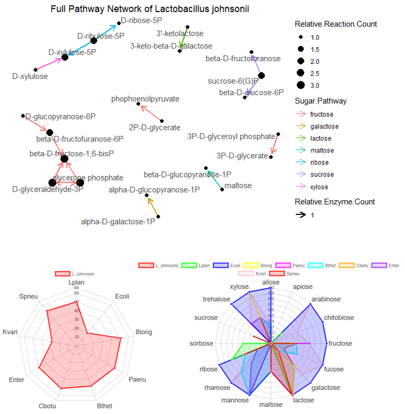

<!-- README.md is generated from README.Rmd. Please edit that file -->

```{r, include = FALSE}
knitr::opts_chunk$set(
  collapse = TRUE,
  comment = "#>",
  fig.path = "man/figures/README-",
  out.height = "100%"
)
```

# microCompet

<!-- badges: start -->
<!-- badges: end -->


## Description
`microCompet` is for identifying and visualizing potential microbial competitions for nutrition, mainly simple sugars such as pentoses an pyranoses. This package offers functions to:

1. Visualize all sugar degradation pathways that are present in one microbe of interest (See function _*constructFullNetwork*_)
2. Compare a microbe's overall similarity of sugar degradation profile to other microbes (See functions _*overallSimilarity*_ and _*competeMicrobiota*_)


## Installation
To install the package:
```{r, eval = FALSE}
require("devtools")
devtools::install_github("MolyWang/microCompet", build_vignettes = TRUE)
library("microCompet")
```
To run the Shiny app:
```{r, eval=FALSE}
microCompet::runMicroCompet()
```


## Overview
To list the available 5 functions and 3 datasets in the package:
```{r, eval = FALSE}
ls("package:microCompet")
data(package = "microCompet")
```

### Datasets EnzymaticReactions, EnzymeDistribution & GenomesInfo
As dataset names indicated, _*EnzymaticReactions*_ describes enzymatic reactions involved in simple sugar degradation pathways, and _*EnzymeDistribution*_ includes data regarding the distribution of these enzymes in various gut microbiota members. For more information on these genomes, you can see _*GenomesInfo*_ and find the original annotated genome from NCBI using provided Accession ID. For more details, check the dataset description files by `?DatasetName`

### Functions extractCarboGenes & checkUserED
These two functions can be treated as exported helper functions for users. The most readily available genome files are genbank(.gb or .gbk) and _*extractCarboGenes*_ would extract genes encoding sugar degradation enzymes for other functions to operate on.

While _*checkUserED*_ helps user to check some required features/columns in provided dataset _*EnzymeDistribution*_. Datasets pass this check is very likely to work properly with _*overallSimilarity*_ and _*competeMicrobiota*_, but more details are checked within functions.


### Functions constructFullNetwork, overallSimilarity & competeMicrobiota

Function __*constructFullNetwork*__ takes a vector of genes and plot its full sugar degradation pathways, the following image is a sample output using the provided *Lactobacillus_johnsonii.gb* genome. Function __*overallSimilarity*__ count sugar degradation genes in common between the given genome and other microbial species, and creates an interactive radar graph. The final function __*competeMicrobiota*__ visualize available microbes in terms of pathway completeness, suggesting their ability to fully degrade indicated sugar sources.





Refer to package vignettes for more details.
```{r, eval = FALSE}
browseVignettes("microCompet")
```
The package tree structure is provided below.
```{r, eval = FALSE}
- microCompet
  |- microCompet.Rproj
  |- DESCRIPTION
  |- NAMESPACE
  |- LICENSE
  |- README
  |- data
    |- EnzymaticReactions.rda
    |- EnzymeDistribution.rda
    |- GenomesInfo.rda
  |- inst
    |- CITATION
    |- extdata
      |- comp1.png
      |- comp2.png
      |- Kvari_pathway.png
      |- Ljohn.png
      |- microbiome.jpg
      |- overSimi1.png
    |- shiny-scripts
      |- app.R
  |- man
    |- allSugarScoresForOneGenome.Rd
    |- calculateStepsForOneSugar.Rd
    |- calclateTotalStepsForAllSugars.Rd
    |- checkUserED.Rd
    |- compareTwoGenomes.Rd
    |- competeMicrobiota.Rd
    |- completenessForAllPathways.Rd
    |- constructFullNetwork.Rd
    |- createEdgeFrame.Rd
    |- createNodeFrame.Rd
    |- EnzymaticReactions.Rd
    |- EnzymeDistribution.Rd
    |- extractCarboGenes.Rd
    |- GenomesInfo.Rd
    |- overallSimilarity.Rd
    |- transformToVector.Rd
    |- TransformToVector.Rd
  |- R
    |- checkUserED.R
    |- competeMicrobiota.R
    |- constructFullNetwork.R
    |- data.R
    |- extractCarboGenes.R
    |- overallSimilarity.R
    |- runMicroCompet.R
  |- tests
``` 


## Contributions
The author of this package is Zhuyi Wang. Information included in _EnzymaticReactions_ are retrieved from MetaCyc (metacyc.org), while data included in _EnzymeDistribution_ are annotated genome downloaded from NCBI (see details in _GenomesInfo_) and processed by Python scripts (also written by Zhuyi). Functions _overallSimilarity_ and _competeMicrobiota_ took advantage of one function _chartJSRadar_ from R package _radarchart_, which decorates dataframes with interactive features and beautifully selected colors that agree with my aesthetics. Another function _constructFullNetwork_ was dependency-heavy, it is built upon functions from _igraph_ and _ggraph_, which then depend on _network_, _sna_, and _ggplot2_.


## References
1. Butts, C. 2008. “network: a Package for Managing Relational Data in R.” _Journal of Statistical Software_. 24(2). <URL: https://www.jstatsoft.org/v24/i02/paper>.

2. Butts, C. 2020. network: Classes for Relational Data. The Statnet Project (<URL:http://www.statnet.org>). R package version 1.16.1, <URL: https://CRAN.R-project.org/package=network>.

3. Butts, C.T. 2020. sna: Tools for Social Network Analysis. R package version 2.6. https://CRAN.R-project.org/package=sna

4. Csardi, G., Nepusz, T. 2006. The igraph software package for complex network research, InterJournal, Complex Systems 1695. https://igraph.org

5. Karp, P.D., Riley, M., Paley, S.M., and Pellegrini-Toole A. 2002. The MetaCyc Database. _Nucleic Acids Re_. 30(1):59-61. doi:10.1093/nar/30.1.59

6. National Center for Biotechnology Information (NCBI)[Internet]. Bethesda (MD): National Library of Medicine (US), National Center for Biotechnology Information [1988]. Available from: https://www.ncbi.nlm.nih.gov/

7. Pedersen, T.L. 2020. ggraph: An Implementation of Grammar of Graphics for Graphs and Networks. R package version 2.0.3. https://CRAN.R-project.org/package=ggraph

8. R Core Team. 2020. R: A language and environment for statistical computing. R Foundation for Statistical Computing. Vienna, Austria. URL: https://www.R-project.org/.

9. Wickham, H. 2016. ggplot2: Elegant Graphics for Data Analysis. Springer-Verlag New York.

10. Wickham, H. 2020. R Packages. https://r-pkgs.org/

11. Xie, Y. 2020. bookdown: Authoring Books and Technical Documents with R Markdown. https://bookdown.org/yihui/bookdown/


## Acknowledgements
This package was developed as part of an assessment for 2019-2020 BCB410H: Applied Bioinformatics, University of Toronto, Toronto, CANADA.


## Examples

### 1. constructFullNetwork
A quick example for *_constructFullNetwork_*, and this would reproduce the network image you saw in the *_Overview_* part, making use of *_extractCarboGenes_* and the carried genbank file *_Lactobacillus_johnsonii.gb_.* This package also comes with another genbank file *_Klebsiella_variicola.gb_* (find it in inst/extdata). *_Klebsiella_* genus has a more complete sugar degradation system and would produce a busier image. More function detail in function description files with `?functionName`
```{r constructFullNetwork, message=FALSE, warning=FALSE, out.width="800px"}
require("microCompet")
ER <- microCompet::EnzymaticReactions
ED <- microCompet::EnzymeDistribution
fullEnzymeGeneList <- ED$Gene
genomeFilePath <- system.file("extdata",
                              "Lactobacillus_johnsonii.gb", #You can also try "Klebsiella_variicola.gb"
                              package = "microCompet",
                              mustWork = TRUE)
carboGenes <- extractCarboGenes(genomeFilePath, fullEnzymeGeneList)
fullPathway <- constructFullNetwork("Lactobacillus johnsonii", carboGenes, ER)
fullPathway
```

### 2. overallSimilarity 
The second example quickly shows you a sample output from *_overallSimilarity_.* You can comment out the indicated lines if you've run the previous example. *_extractCarboGenes_* is a slow function and you want to play the cute image as soon as possible!
```{r overallSimilarity, echo=TRUE, message=FALSE, warning=FALSE, screenshot.alt="./inst/extdata/overallSimilarity.png"}
require("microCompet")
require("radarchart")
genomeName <- "L. johnsonii"
# Uncomment the indicated lines if you haven't run the previous example.
ED <- microCompet::EnzymeDistribution                                  #
fullEnzymeGeneVec <- ED$Gene                                           #
genomeFilePath <- system.file("extdata",                               #
                              "Lactobacillus_johnsonii.gb",            #
                              package = "microCompet",                 #
                              mustWork = TRUE)                         #
carboGenes <- extractCarboGenes(genomeFilePath, fullEnzymeGeneVec)     #
overSimiFig <- overallSimilarity(genomeName, carboGenes, ED, 5, 13)
overSimiFig
```

### 3. competeMicrobiota 
The third example shows a sample image from *_competeMicrobiota_.* Same as before, you don't have to rerun code for generating geneVec carboGenes. Run this in your R console, navigate through your favourite microbes, and enjoy its interactive features (unfortunately loss during knitting TAT).
```{r competeMicrobiota, message=FALSE, warning=FALSE, screenshot.alt="./inst/extdata/competeMicrobiota.png"}
require("microCompet")
require("radarchart")
genomeName <- "L. johnsonii"
ED <- microCompet::EnzymeDistribution
fullEnzymeGeneVec <- ED$Gene                                         #
genomeFilePath <- system.file("extdata",                             #
                              "Lactobacillus_johnsonii.gb",          #
                              package = "microCompet",               #
                              mustWork = TRUE)                       #
carboGenes <- extractCarboGenes(genomeFilePath, fullEnzymeGeneVec)   #
firstMicrobe <- 5
lastMicrobe <- 13
ER <- microCompet::EnzymaticReactions
compMicro <- competeMicrobiota(genomeName, carboGenes, ER,
                               ED, firstMicrobe, lastMicrobe)
compMicro
```


## Consent
As on 2020-11-26, I, Zhuyi Wang, consent to leave this package public and share it with future BCB410 students.

