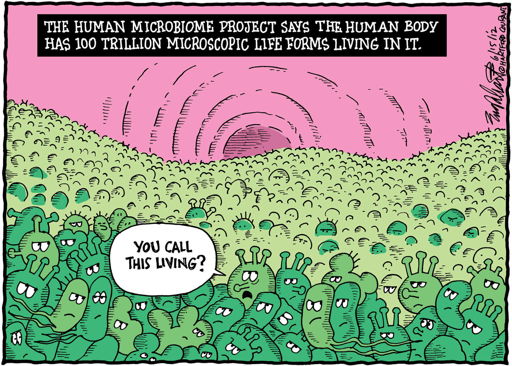

```{r, include = FALSE}
library(knitr)
opts_chunk$set(fig.align = "center", 
               out.width = "50%",
               fig.width = 1, fig.height = 0.8,
               dev.args=list(pointsize=10),
               par = TRUE, # needed for setting hook 
               collapse = TRUE, # collapse input & ouput code in chunks
               warning = FALSE)
knit_hooks$set(par = function(before, options, envir)
  { if(before && options$fig.show != "none") 
       par(family = "sans", mar=c(4.1,4.1,1.1,1.1), mgp=c(3,1,0), tcl=-0.5)
})
set.seed(1) # for exact reproducibility
```

__*Welcome to the world of microbes and microbiota!*__



https://emerypharma.com/blog/human_microbiome_healthier_life/

## Introduction
_microCompet_ is a package for visualizing potential microbial competition for simple sugars as sources of nutrition and energy. It can plot all pathways one microbe has, evaluate each pathway's completeness, and compare across species to score the potential for competition. 

To use this package, the only required input from users is a microbial genome in the format of an *__ANNOTATED__ GenBank file*. By annotated, this means "genes" are labeled onto a genome, and the file is not one very very very long line of ATCG. see provided files in the main directory for example, Klebsiella_variicola.gb, Lactobacillus_johnsonii.gb. (Microbe names are hard to pronounce, but it's harder to resist the temptation to try!). 

The first step is to load the library, and following this vignettes do not require any other user input.
```{r, eval=FALSE}
library(microCompet)
# and load all dependencies
require(radarchart)
require(ggraph)
require(network)
require(sna)
require(ggplot2)
require(igraph)
```


## Available Datasets
__1. EnzymaticReactions__

Each row in this dataset uses 6 attributes to describe an enzymatic reaction.

If a reaction equation is substrate1 ---> product1, catalyzed by enzyme E1. Now we obviously have *Substrate*, *Product*, and *Enzyme*. *Gene* is the name of a gene that encodes enzyme E1, and different microbial species may different genes encoding slightly different versions E1. *Reaction.EC* is a universal naming system for enzymes based on the category of reaction it catalyzed, full version is Enzyme Commission, usually in the form of 2.7.1.55. The last *Sugar* is to describe which sugar this enzyme involves in degrading.

If a reaction is substrate1 ---> product1 + product2, then they are written as two separate lines with one product per line (all other attributes would be the same). This is for easier network presentation.


__2. EnzymeDistribution__

Each row describes one gene/enzye and its distribution in microbes. The first 4 columns *Gene*, *Reaction.EC*, *Enzyme*, *Sugar* are the same as described in __EnzymaticReactions__. While column 5 to 13 describe 9 genomes. These 9 species are named by first letter of genus and first four letters of species, thus Klebsiella variicola is "Kvari". Check their full name by:
```{r, eval=FALSE}
colnames(EnzymeDistribution)[5:13]
```
A "0" suggest this species/genome does not encode the gene in the row, while "1" suggests it's encoded.


__Attention for self-defined dataseets__
If you read in a data frame from a csv, tsv, excel file, be careful about empty spaces in the cell. All functions used here are sensitive the spaces, and "ribose" and "ribose " is not considered as the same sugar. You can call the trim() function in excel before saving the dataset.

## Available Functions
__1. extractCarboGenes__


## References
1. Butts, C. 2008. “network: a Package for Managing Relational Data in R.” _Journal of Statistical Software_. 24(2). <URL: https://www.jstatsoft.org/v24/i02/paper>.

2. Butts, C. 2020. network: Classes for Relational Data. The Statnet Project (<URL:http://www.statnet.org>). R package version 1.16.1, <URL: https://CRAN.R-project.org/package=network>.

3. Butts, C.T. 2020. sna: Tools for Social Network Analysis. R package version 2.6. https://CRAN.R-project.org/package=sna

4. Csardi, G., Nepusz, T. 2006. The igraph software package for complex network research, InterJournal, Complex Systems 1695. https://igraph.org

5. Karp, P.D., Riley, M., Paley, S.M., and Pellegrini-Toole A. 2002. The MetaCyc Database. *Nucleic Acids Res*. 30(1):59-61. doi:10.1093/nar/30.1.59

6. National Center for Biotechnology Information (NCBI)[Internet]. Bethesda (MD): National Library of Medicine (US), National Center for Biotechnology Information; [1988]. Available from: https://www.ncbi.nlm.nih.gov/

7. Pedersen, T.L. 2020. ggraph: An Implementation of Grammar of Graphics for Graphs and Networks. R package version 2.0.3. https://CRAN.R-project.org/package=ggraph

8. R Core Team. 2020. R: A language and environment for statistical computing. R Foundation for Statistical Computing, Vienna, Austria. URL: https://www.R-project.org/.

9. Wickham, H. 2016. ggplot2: Elegant Graphics for Data Analysis. Springer-Verlag New York.

